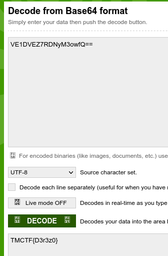

# WarmUp

## Determining the File

```bash
file WarmUp.exe 
```

The output shows us that it is a "PE32+ executable x86_64 for MS Windows", which basically means it is an actual exe file.

## Running the File


## Decoding

Based on the last character being an equal sign "=", we can tell it is encoded in base64. Using an online decoder, we can get the decoded message.



## SUCCESS

We have captured the TMCTF{D3r3z0} flag.
